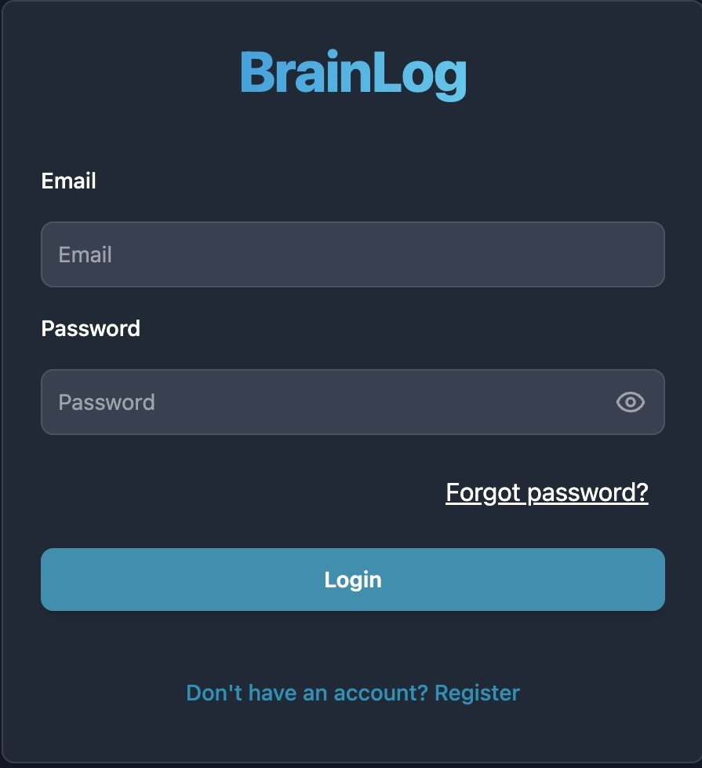
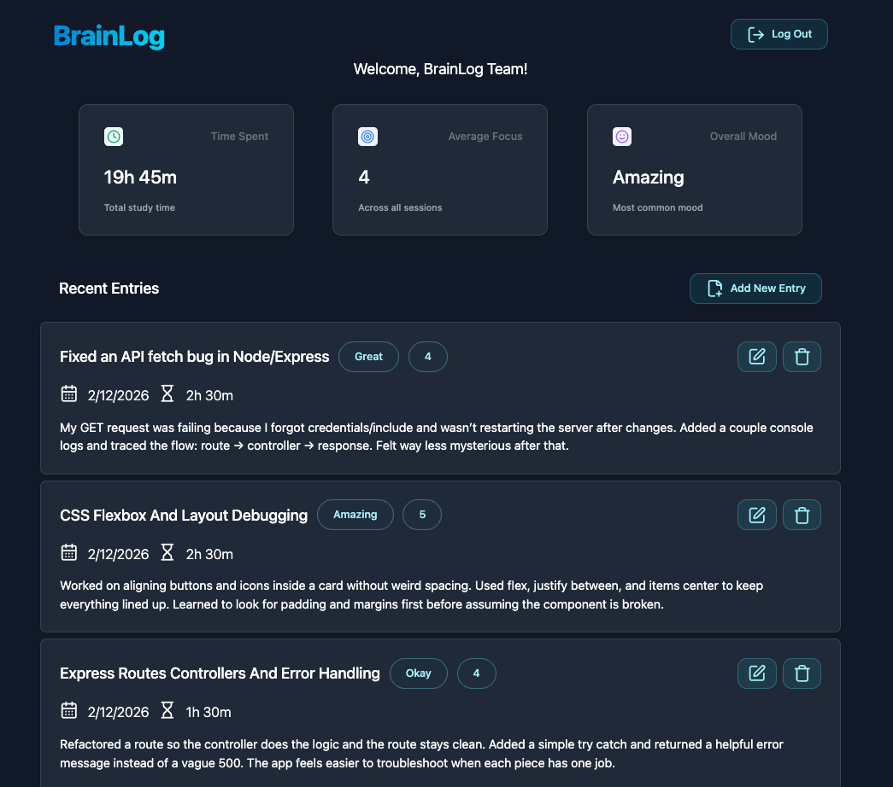

# BrainLog

**BrainLog** is a full-stack web application with a React frontend and a Node/Express backend that helps students keep a structured record of their study sessions and reflections. It enables users to track progress over time, revisit key concepts, and gain insights into their learning patterns using data stored in a database.

## 🚀 Live Demo

- **Frontend Live Site:** https://k-group-practicum-team6.vercel.app  
- **Frontend Repo:** /frontend  
- **Backend Repo:** /backend
- **Mobile Repo:** /mobile

## 🧠 Problem Statement

Students often forget what they’ve studied, how long they spent, and what insights they uncovered along the way. Their notes can get scattered across apps, notebooks, sticky notes, etc, and this makes it hard to see their progress over time. This can also make it difficult to quickly revisit key concepts before exams and interviews.

The purpose of this application is to help students keep a structured record of their study sessions and daily reflections so they can:

See consistent progress and wins over weeks and months to stay motivated
Revisit key concepts, resources, and ah-ha moments
Gain insight into their learning patterns (time spent, focus level, wins, struggles, etc)


## 🎯 Features

- User authentication (register, login, logout)
- CRUD operations for core resources
- Protected routes and authorization
- Responsive UI (mobile & desktop)
- Form validation and error handling
- RESTful API integration

## 📸 Screenshots




## 🛠 Tech Stack

### Frontend
- React
- JavaScript (ES6+)
- HTML5
- CSS3 / Tailwind / Bootstrap
- Vite React App

### Mobile
- Expo/Expo-Router
- React-Native
- Zustand
- React Query
- React Hook Form
- Yup

### Backend
- Node.js
- Express.js
- REST API

### Database
- MongoDB (Mongoose) **or**

### Tooling
- Git & GitHub
- dotenv (environment variables)
- ESLint / Prettier

## 📁 Project Structure

```text
K-GROUP-PRACTICUM-TEAM6/
├── frontend/
│   ├── src/
│   │   ├── assets/
│   │   ├── pages/
│   │   ├── components/
│   │   ├── services/        
│   │   ├── routes/
│   │   ├── utils/
│   │   ├── App.jsx
│   │   └── main.jsx
│   ├── index.html
│   └── package.json
│
├── backend/
|   ├── src/
|   │   │   ├── controllers/
|   │   │   ├── routes/
|   │   │   ├── models/
|   │   │   ├── middleware/        
|   │   │   ├── config/
|   │   │   └── app.js
|   │   ├── server.js
|   │   └── package.json
│
└── README.md
├── mobile/
|   │   │   ├── app/
|   │   │   ├── assets/
|   │   │   ├── components/
|   │   │   ├── hooks/        
|   │   │   ├── interfaces/
|   │   │   └── utils/
|   │   └── package.json
│
└── README.md
```

## ⚙️ Setup & Installation

### Prerequisites
- Node.js (v18+ recommended)
- npm
- MongoDB or PostgreSQL (local or cloud)

### Backend Setup

```bash
cd backend
npm install
npm run dev
```

Create a `.env` file inside the `backend` folder:

```env
PORT=5000
DATABASE_URL=your_database_url
JWT_SECRET=your_secret_key
JWT_LIFETIME=amount_of_time
CLIENT_URLS=http://localhost:5173,http://localhost:8081
```
CLIENT_URLS is used for CORS configuration.
These are the default URLs(Web VITE / Mobile Expo).
Make sure to include all frontend URLs that will access the backend.
Separate them with commas, without spaces or a trailing comma.

Backend runs on:  
http://localhost:5000

### Frontend Setup

```bash
cd frontend
npm install
npm run dev
```

Create a `.env` file inside the `frontend` folder:

```env
VITE_API_URL=your_localhost_port/api/v1
```
Frontend runs on:  
http://localhost:5173

### Mobile Setup

```bash
   cd mobile
   npm install
   npx expo start
```
1. Install the **Expo Go** app on your phone (available on iOS and Android).
2. Make sure your phone and computer are connected to the same Wi-Fi network.
3. Scan the QR code from the terminal using the Expo Go app or you Camera.
4. Create a `.env` file inside the `mobile` folder:

```env
# if you want to test your app in the browser 
EXPO_PUBLIC_WEB_API_URL=http://localhost:5000/api/v1

# if you want to test your app with expo go on your mobile phone
EXPO_PUBLIC_MOBILE_API_URL=http://your-local-ip-adress:5000/api/v1
```
Mobile web by default runs on:
http://localhost:8081

## 🧪 Available Scripts

### Frontend
```bash
npm run dev
npm run build
npm run preview
```
### Mobile
```bash
npm run start         # Start Expo dev server
npm run android       # Launch Android emulator (Android stuido required)
npm run ios           # Launch iOS simulator (Mac only - Xcode required)
npm run web           # Run as web app
```

### Backend
```bash
npm run dev
npm start
```

## 🔐 API Overview

### Endpoints

```text
POST   /api/auth/register
POST   /api/auth/login
GET    /api/ -> getAllEntries
POST   /api/ -> createEntry
PATCH  /api/:id -> updateEntry
DELETE /api/:id -> deleteEntry
```

## 🤝 Team & Collaboration

### Team Members
- Ben Ong
- Mike McDonald
- Brittany Price
- Irina Khameeva
- Danylo Hetmanenko

### Workflow
- Jira tickets for task tracking
- Feature branches for development
- Approved Pull Requests required for all merges
- Code reviews before merging to `dev`
- Update `main` when MVP is in production

## 🧩 Development Process

- Agile / sprint-based workflow
- Backend API built in tandem with frontend integration
- MVP defined early
- Incremental feature development

## 📌 Known Issues / Limitations

- Limited role-based access control
- No automated tests yet
- Performance optimizations pending

## 🛣 Future Improvements

- Add automated testing (Jest, Supertest)
- Improve security and validation
- Add caching and performance improvements
- Dockerize the application

## 🙌 Acknowledgments

- Mentors/Instructors: Dan Polityka, Tommy Armstrong, and Amandeep Dhothar
- Open-source libraries and tools: Flowbite, Lucide

## 📄 License

This project is for educational purposes only.
